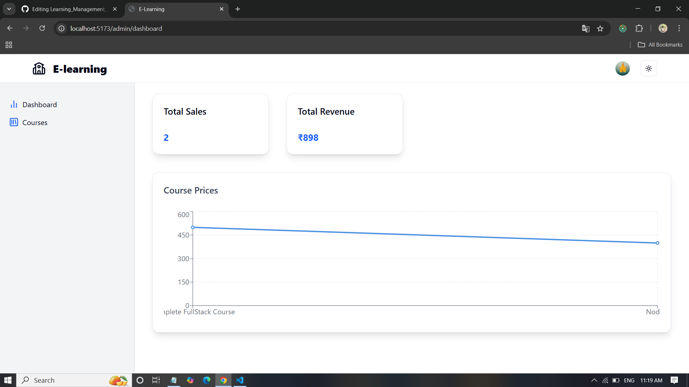
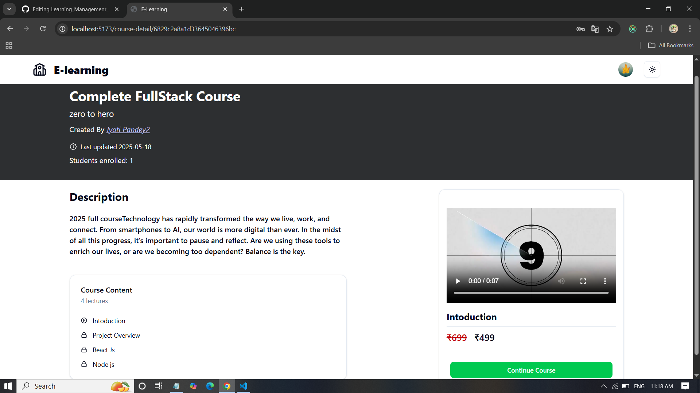
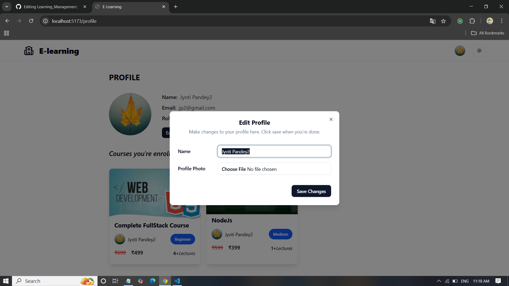
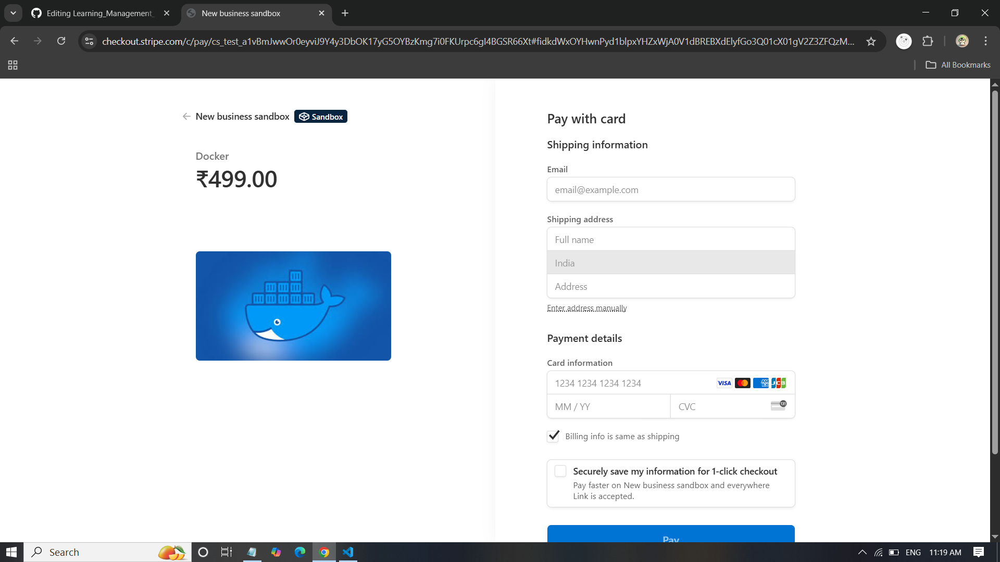
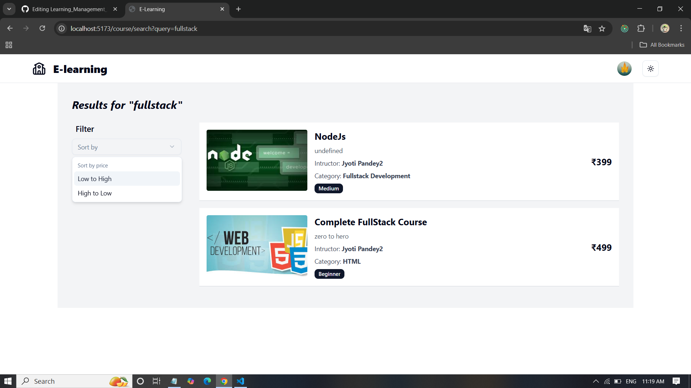
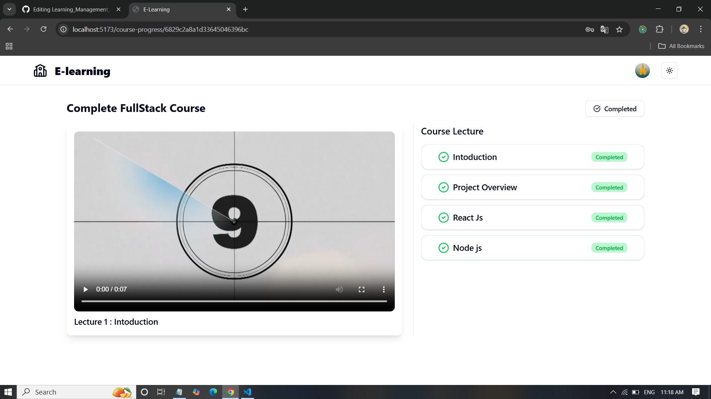

# Learning Management System (LMS)

A full-featured Learning Management System built using the **MERN Stack**, integrated with **Redux Toolkit**, **RTK Query**, **JWT Authentication**, **Stripe Payments**, **Cloudinary**, and **ShadCN UI**. The platform enables students to explore, purchase, and complete courses, while instructors can manage and publish learning content with ease and security.

---

## Features

### Student Functionalities:
- Browse all available courses and filter/search them.
- View course details before enrolling.
- Securely purchase courses using **Stripe Payment Gateway**.
- Watch lecture videos in order and track course progress.
- View completed lectures and progress.
- Manage personal profile and update user information.

### Instructor Functionalities:
- Instructor authentication with protected routes.
- Create, edit, and delete courses.
- Add and manage lectures (video upload via **Cloudinary**).
- View all created courses and associated content.
- Access a personal dashboard with analytics and performance metrics.

---

## Tech Stack

| Category       | Tech Used                          |
|----------------|------------------------------------|
| Frontend       | React.js, Redux Toolkit, RTK Query |
| Styling        | Tailwind CSS, ShadCN UI            |
| Backend        | Node.js, Express.js                |
| Database       | MongoDB + Mongoose ODM             |
| Authentication | JWT (Role-Based Auth)              |
| Media Storage  | Cloudinary                         |
| Payments       | Stripe API                         |

---

## Security Highlights

- **JWT Authentication** for both Student and Instructor with role-based access.
- All routes are **fully protected** – APIs cannot be accessed without valid credentials.
- Instructors are the **only users allowed** to create or manage course content.
- Secure video uploads using Cloudinary.
- Stripe ensures secure and encrypted transactions.

---

## Installation

### Prerequisites
- Node.js
- MongoDB Atlas or local instance
- Cloudinary account (for media)
- Stripe account (for payments)

### Backend Setup

```bash
cd server
npm install
npm run dev
```

### frontend Setup
```bash
cd client
npm install
npm start
```

## Screenshots

  
  
  
  
  
  


### Author
Jyoti Pandey
MERN stack developer

